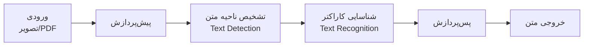
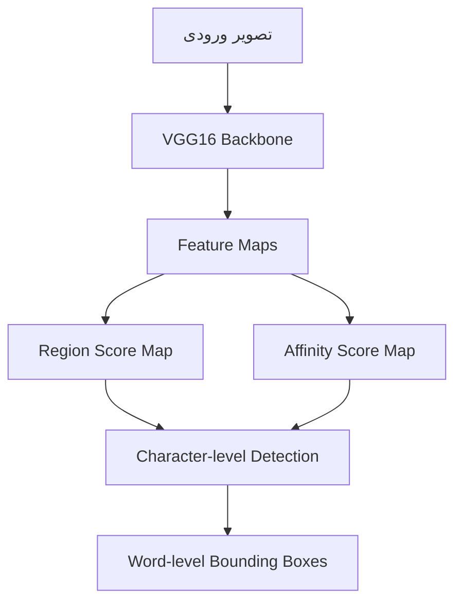
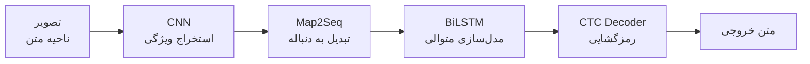
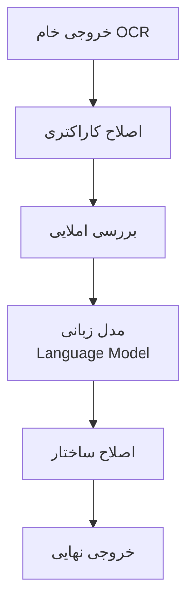

# 🗺️ نقشه راه ساخت برنامه OCR پیشرفته با پایتون و PyTorch

> **هدف نهایی:** ساخت یک سیستم OCR قدرتمند که قادر به خواندن متن از تصاویر، اسناد PDF و فایل‌های متنی مختلف باشد — با پشتیبانی از زبان فارسی و انگلیسی.

---

## 📋 فهرست مراحل

| مرحله | عنوان | مدت تقریبی |
|:------:|:------|:----------:|
| ۰ | پیش‌نیازها و آماده‌سازی محیط | ۱ هفته |
| ۱ | درک مفاهیم پایه OCR | ۱-۲ هفته |
| ۲ | پیش‌پردازش تصویر | ۲ هفته |
| ۳ | تشخیص ناحیه متن (Text Detection) | ۲-۳ هفته |
| ۴ | شناسایی کاراکتر (Text Recognition) | ۳-۴ هفته |
| ۵ | پردازش PDF | ۱-۲ هفته |
| ۶ | پس‌پردازش و اصلاح خطا | ۱-۲ هفته |
| ۷ | یکپارچه‌سازی Pipeline کامل | ۲ هفته |
| ۸ | بهینه‌سازی و استقرار | ۲ هفته |
| ۹ | رابط کاربری و API | ۱-۲ هفته |

> **مجموع تقریبی: ۴-۵ ماه**

---

## مرحله ۰: پیش‌نیازها و آماده‌سازی محیط

### 🎯 اهداف
- نصب و پیکربندی ابزارهای لازم
- آشنایی با ساختار پروژه

### 📦 ابزارها و کتابخانه‌ها

```
Python >= 3.10
PyTorch >= 2.0
torchvision
OpenCV (cv2)
Pillow (PIL)
NumPy
pdf2image
PyMuPDF (fitz)
pytesseract (به عنوان baseline)
albumentations (Data Augmentation)
matplotlib
```

### 🏗️ ساختار پیشنهادی پروژه

```
ocr-project/
├── data/
│   ├── raw/                  # داده‌های خام
│   ├── processed/            # داده‌های پردازش‌شده
│   ├── train/
│   ├── val/
│   └── test/
├── models/
│   ├── detection/            # مدل‌های تشخیص ناحیه متن
│   │   ├── craft.py
│   │   └── east.py
│   ├── recognition/          # مدل‌های شناسایی کاراکتر
│   │   ├── crnn.py
│   │   └── transformer_ocr.py
│   └── pretrained/           # وزن‌های از پیش آموزش‌دیده
├── preprocessing/
│   ├── image_processing.py
│   ├── pdf_processing.py
│   └── augmentation.py
├── postprocessing/
│   ├── spell_checker.py
│   ├── text_formatter.py
│   └── language_model.py
├── utils/
│   ├── dataset.py
│   ├── metrics.py
│   └── visualize.py
├── api/
│   ├── app.py
│   └── routes.py
├── configs/
│   └── config.yaml
├── notebooks/                # آزمایش و تحلیل
├── tests/
├── train.py
├── inference.py
├── requirements.txt
└── README.md
```

### ✅ چک‌لیست

- [ ] نصب Python و PyTorch با پشتیبانی CUDA
- [ ] ساخت محیط مجازی (`venv` یا `conda`)
- [ ] نصب تمام وابستگی‌ها
- [ ] تست اولیه GPU با PyTorch
- [ ] آشنایی با ساختار پروژه

---

## مرحله ۱: درک مفاهیم پایه OCR

### 🎯 اهداف
- درک خط لوله (Pipeline) کامل OCR
- آشنایی با معماری‌های رایج

### 📖 مفاهیم کلیدی



### 🧠 معماری‌هایی که باید بشناسید

| معماری | نوع | کاربرد |
|--------|-----|--------|
| **CRAFT** | Detection | تشخیص ناحیه متن در تصاویر پیچیده |
| **EAST** | Detection | تشخیص سریع متن |
| **CRNN** | Recognition | ترکیب CNN + RNN برای شناسایی متوالی |
| **TrOCR** | Recognition | معماری Transformer برای OCR |
| **ViT + CTC** | Recognition | Vision Transformer با CTC Loss |
| **ASTER** | Recognition | مقاوم در برابر چرخش و اعوجاج |
| **ABINet** | Recognition | استفاده از مدل زبانی داخلی |

### 📚 منابع مطالعاتی

- [ ] مقاله [An End-to-End Trainable Neural Network for Image-based Sequence Recognition (CRNN)](https://arxiv.org/abs/1507.05717)
- [ ] مقاله [CRAFT: Character Region Awareness for Text Detection](https://arxiv.org/abs/1904.01941)
- [ ] مقاله [TrOCR: Transformer-based OCR](https://arxiv.org/abs/2109.10282)
- [ ] دوره Stanford CS231n (بخش CNN)
- [ ] مستندات PyTorch — بخش `torchvision.models`

---

## مرحله ۲: پیش‌پردازش تصویر

### 🎯 اهداف
- آماده‌سازی تصاویر برای ورود به مدل
- پیاده‌سازی تکنیک‌های بهبود کیفیت تصویر

### 🔧 تکنیک‌های پیش‌پردازش

```
1. تبدیل به Grayscale
2. حذف نویز (Denoising)
   ├── Gaussian Blur
   ├── Median Filter
   └── Non-Local Means Denoising
3. آستانه‌گذاری (Thresholding)
   ├── Binary
   ├── Adaptive (Gaussian / Mean)
   └── Otsu's Method
4. تصحیح زاویه (Deskewing)
5. تغییر اندازه و نرمال‌سازی
6. حذف حاشیه و قاب
7. افزایش کنتراست (CLAHE)
8. مورفولوژی (Erosion / Dilation)
```

### 💻 نمونه کد پیش‌پردازش

```python
import cv2
import numpy as np

class ImagePreprocessor:
    def __init__(self, target_size=(640, 640)):
        self.target_size = target_size
    
    def process(self, image: np.ndarray) -> np.ndarray:
        # تبدیل به خاکستری
        gray = cv2.cvtColor(image, cv2.COLOR_BGR2GRAY)
        
        # حذف نویز
        denoised = cv2.fastNlMeansDenoising(gray, h=10)
        
        # افزایش کنتراست
        clahe = cv2.createCLAHE(clipLimit=2.0, tileGridSize=(8, 8))
        enhanced = clahe.apply(denoised)
        
        # آستانه‌گذاری تطبیقی
        binary = cv2.adaptiveThreshold(
            enhanced, 255,
            cv2.ADAPTIVE_THRESH_GAUSSIAN_C,
            cv2.THRESH_BINARY, 11, 2
        )
        
        # تصحیح زاویه
        corrected = self._deskew(binary)
        
        return corrected
    
    def _deskew(self, image: np.ndarray) -> np.ndarray:
        coords = np.column_stack(np.where(image > 0))
        angle = cv2.minAreaRect(coords)[-1]
        if angle < -45:
            angle = -(90 + angle)
        else:
            angle = -angle
        (h, w) = image.shape[:2]
        center = (w // 2, h // 2)
        M = cv2.getRotationMatrix2D(center, angle, 1.0)
        rotated = cv2.warpAffine(
            image, M, (w, h),
            flags=cv2.INTER_CUBIC,
            borderMode=cv2.BORDER_REPLICATE
        )
        return rotated
```

### ✅ چک‌لیست

- [ ] پیاده‌سازی کلاس `ImagePreprocessor`
- [ ] تست با تصاویر مختلف (نور کم، زاویه‌دار، نویزی)
- [ ] پیاده‌سازی Data Augmentation با `albumentations`
- [ ] بنچمارک سرعت پیش‌پردازش

---

## مرحله ۳: تشخیص ناحیه متن (Text Detection)

### 🎯 اهداف
- پیدا کردن مکان متن‌ها در تصویر
- ایجاد Bounding Box دور هر بلوک متنی

### 🏛️ معماری پیشنهادی: CRAFT



### 💻 ساختار مدل CRAFT

```python
import torch
import torch.nn as nn
import torchvision.models as models

class CRAFT(nn.Module):
    def __init__(self, pretrained=True):
        super(CRAFT, self).__init__()
        
        # Backbone: VGG16
        vgg16 = models.vgg16_bn(pretrained=pretrained)
        self.features = vgg16.features
        
        # Upsampling layers
        self.upconv1 = self._make_upconv(512, 256)
        self.upconv2 = self._make_upconv(256, 128)
        self.upconv3 = self._make_upconv(128, 64)
        self.upconv4 = self._make_upconv(64, 32)
        
        # Output heads
        self.region_head = nn.Conv2d(32, 1, kernel_size=1)   # Region score
        self.affinity_head = nn.Conv2d(32, 1, kernel_size=1) # Affinity score
    
    def _make_upconv(self, in_ch, out_ch):
        return nn.Sequential(
            nn.ConvTranspose2d(in_ch, out_ch, kernel_size=2, stride=2),
            nn.BatchNorm2d(out_ch),
            nn.ReLU(inplace=True),
            nn.Conv2d(out_ch, out_ch, kernel_size=3, padding=1),
            nn.BatchNorm2d(out_ch),
            nn.ReLU(inplace=True),
        )
    
    def forward(self, x):
        # Feature extraction
        features = self.features(x)
        
        # Upsampling
        x = self.upconv1(features)
        x = self.upconv2(x)
        x = self.upconv3(x)
        x = self.upconv4(x)
        
        # Predictions
        region_score = torch.sigmoid(self.region_head(x))
        affinity_score = torch.sigmoid(self.affinity_head(x))
        
        return region_score, affinity_score
```

### 📊 دیتاست‌های آموزشی

| دیتاست | توضیحات | لینک |
|---------|---------|------|
| **SynthText** | ۸۰۰K تصویر مصنوعی | [GitHub](https://github.com/ankush-me/SynthText) |
| **ICDAR 2015** | استاندارد صنعتی | [ICDAR](https://rrc.cvc.uab.es/) |
| **ICDAR 2019** | چند زبانه | [ICDAR](https://rrc.cvc.uab.es/) |
| **Total-Text** | متن‌های منحنی | [GitHub](https://github.com/cs-chan/Total-Text-Dataset) |
| **داده فارسی** | ساخت دیتاست سفارشی | — |

### ✅ چک‌لیست

- [ ] پیاده‌سازی مدل CRAFT با PyTorch
- [ ] آماده‌سازی دیتاست (SynthText + ICDAR)
- [ ] آموزش مدل Detection
- [ ] ارزیابی با معیارهای Precision، Recall، F1
- [ ] پیاده‌سازی Non-Maximum Suppression (NMS)
- [ ] تست با تصاویر واقعی فارسی و انگلیسی

---

## مرحله ۴: شناسایی کاراکتر (Text Recognition)

### 🎯 اهداف
- خواندن متن از نواحی تشخیص داده شده
- پشتیبانی از فارسی و انگلیسی

### 🏛️ معماری اصلی: CRNN + CTC



### 💻 مدل CRNN

```python
import torch
import torch.nn as nn

class CRNN(nn.Module):
    def __init__(self, img_height, num_channels, num_classes, hidden_size=256):
        super(CRNN, self).__init__()
        
        # CNN — استخراج ویژگی
        self.cnn = nn.Sequential(
            # Block 1
            nn.Conv2d(num_channels, 64, 3, 1, 1), nn.ReLU(), nn.MaxPool2d(2, 2),
            # Block 2
            nn.Conv2d(64, 128, 3, 1, 1), nn.ReLU(), nn.MaxPool2d(2, 2),
            # Block 3
            nn.Conv2d(128, 256, 3, 1, 1), nn.BatchNorm2d(256), nn.ReLU(),
            nn.Conv2d(256, 256, 3, 1, 1), nn.ReLU(), nn.MaxPool2d((2, 1), (2, 1)),
            # Block 4
            nn.Conv2d(256, 512, 3, 1, 1), nn.BatchNorm2d(512), nn.ReLU(),
            nn.Conv2d(512, 512, 3, 1, 1), nn.ReLU(), nn.MaxPool2d((2, 1), (2, 1)),
            # Block 5
            nn.Conv2d(512, 512, 2, 1, 0), nn.BatchNorm2d(512), nn.ReLU(),
        )
        
        # RNN — مدل‌سازی متوالی
        self.rnn = nn.Sequential(
            nn.LSTM(512, hidden_size, bidirectional=True, batch_first=True),
        )
        self.linear1 = nn.Linear(hidden_size * 2, hidden_size)
        
        self.rnn2 = nn.LSTM(hidden_size, hidden_size, bidirectional=True, batch_first=True)
        self.linear2 = nn.Linear(hidden_size * 2, num_classes)
    
    def forward(self, x):
        # CNN
        conv = self.cnn(x)                      # (B, C, 1, W)
        conv = conv.squeeze(2)                   # (B, C, W)
        conv = conv.permute(0, 2, 1)             # (B, W, C) — دنباله
        
        # RNN Layer 1
        rnn_out, _ = self.rnn(conv)
        rnn_out = self.linear1(rnn_out)
        
        # RNN Layer 2
        rnn_out, _ = self.rnn2(rnn_out)
        output = self.linear2(rnn_out)
        
        return output  # (B, T, num_classes)
```

### 🏛️ معماری جایگزین: TrOCR (Transformer-based)

```python
import torch
import torch.nn as nn
from torchvision.models import vit_b_16

class TrOCR(nn.Module):
    """
    معماری ساده‌شده TrOCR:
    Vision Transformer (Encoder) + Transformer Decoder
    """
    def __init__(self, vocab_size, d_model=512, nhead=8, num_decoder_layers=6):
        super(TrOCR, self).__init__()
        
        # Encoder: Vision Transformer
        self.encoder = vit_b_16(pretrained=True)
        self.encoder_proj = nn.Linear(1000, d_model)
        
        # Decoder: Transformer Decoder
        decoder_layer = nn.TransformerDecoderLayer(
            d_model=d_model, nhead=nhead, batch_first=True
        )
        self.decoder = nn.TransformerDecoder(decoder_layer, num_decoder_layers)
        
        # Embedding & Output
        self.embedding = nn.Embedding(vocab_size, d_model)
        self.fc_out = nn.Linear(d_model, vocab_size)
        self.positional_encoding = nn.Parameter(torch.randn(1, 256, d_model))
    
    def forward(self, images, targets):
        # Encode
        encoder_out = self.encoder(images)
        encoder_out = self.encoder_proj(encoder_out).unsqueeze(1)
        
        # Decode
        tgt_emb = self.embedding(targets) + self.positional_encoding[:, :targets.size(1), :]
        decoded = self.decoder(tgt_emb, encoder_out)
        output = self.fc_out(decoded)
        
        return output
```

### 🔤 مدیریت مجموعه کاراکترها

```python
class CharsetManager:
    def __init__(self):
        self.persian_chars = "آابپتثجچحخدذرزژسشصضطظعغفقکگلمنوهی"
        self.persian_digits = "۰۱۲۳۴۵۶۷۸۹"
        self.english_chars = "abcdefghijklmnopqrstuvwxyzABCDEFGHIJKLMNOPQRSTUVWXYZ"
        self.english_digits = "0123456789"
        self.special_chars = " .,;:!?()-/\\\"'@#$%&*+=<>{}[]~`^|_"
        self.persian_special = "،؛؟»«"
        
        self.full_charset = (
            self.persian_chars + self.persian_digits +
            self.english_chars + self.english_digits +
            self.special_chars + self.persian_special
        )
        
        # CTC blank token
        self.blank_token = "[BLANK]"
        self.char_to_idx = {c: i + 1 for i, c in enumerate(self.full_charset)}
        self.char_to_idx[self.blank_token] = 0
        self.idx_to_char = {v: k for k, v in self.char_to_idx.items()}
    
    @property
    def num_classes(self):
        return len(self.char_to_idx)
```

### 📊 Loss Function

```python
# CTC Loss — برای CRNN
ctc_loss = nn.CTCLoss(blank=0, zero_infinity=True)

# Cross Entropy — برای TrOCR
ce_loss = nn.CrossEntropyLoss(ignore_index=0)  # padding token = 0
```

### ✅ چک‌لیست

- [ ] پیاده‌سازی CRNN با PyTorch
- [ ] پیاده‌سازی TrOCR (اختیاری ولی پیشنهادی)
- [ ] ساخت `CharsetManager` برای فارسی + انگلیسی
- [ ] آماده‌سازی دیتاست شناسایی (MJSynth, SynthText)
- [ ] آموزش مدل Recognition
- [ ] ارزیابی با معیارهای CER و WER
- [ ] Fine-tune روی داده‌های فارسی
- [ ] مقایسه CRNN و TrOCR

---

## مرحله ۵: پردازش PDF

### 🎯 اهداف
- استخراج متن از PDF‌های متنی (Digital)
- تبدیل PDF‌های تصویری (Scanned) به تصویر و اعمال OCR

### 💻 پیاده‌سازی

```python
import fitz  # PyMuPDF
from pdf2image import convert_from_path
from pathlib import Path

class PDFProcessor:
    def __init__(self, ocr_engine):
        self.ocr_engine = ocr_engine
    
    def process(self, pdf_path: str) -> dict:
        """پردازش PDF و استخراج متن"""
        pdf_path = Path(pdf_path)
        doc = fitz.open(str(pdf_path))
        
        results = {
            "filename": pdf_path.name,
            "total_pages": len(doc),
            "pages": []
        }
        
        for page_num, page in enumerate(doc):
            # ابتدا تلاش برای استخراج متن مستقیم
            text = page.get_text("text").strip()
            
            if text:
                # PDF دیجیتال — متن مستقیماً قابل استخراج
                results["pages"].append({
                    "page": page_num + 1,
                    "type": "digital",
                    "text": text,
                    "confidence": 1.0
                })
            else:
                # PDF اسکن‌شده — نیاز به OCR
                pix = page.get_pixmap(matrix=fitz.Matrix(300/72, 300/72))
                img = self._pixmap_to_numpy(pix)
                
                ocr_result = self.ocr_engine.recognize(img)
                results["pages"].append({
                    "page": page_num + 1,
                    "type": "scanned",
                    "text": ocr_result["text"],
                    "confidence": ocr_result["confidence"]
                })
        
        doc.close()
        return results
    
    def _pixmap_to_numpy(self, pix):
        import numpy as np
        img = np.frombuffer(pix.samples, dtype=np.uint8)
        img = img.reshape(pix.height, pix.width, pix.n)
        return img
```

### ✅ چک‌لیست

- [ ] پیاده‌سازی `PDFProcessor`
- [ ] مدیریت PDF‌های چندصفحه‌ای
- [ ] تشخیص خودکار PDF دیجیتال vs اسکن‌شده
- [ ] استخراج جداول از PDF
- [ ] حفظ ساختار و فرمت متن اصلی
- [ ] تست با PDF‌های فارسی و انگلیسی

---

## مرحله ۶: پس‌پردازش و اصلاح خطا

### 🎯 اهداف
- افزایش دقت خروجی نهایی
- اصلاح خودکار غلط‌های املایی

### 🔧 تکنیک‌های پس‌پردازش



### 💻 پیاده‌سازی

```python
import re
from collections import Counter

class TextPostProcessor:
    def __init__(self):
        # نگاشت کاراکترهای مشابه
        self.char_corrections = {
            '0': 'O', 'l': '1', '|': 'I',
            'ك': 'ک', 'ي': 'ی', 'ة': 'ه',  # تصحیح عربی به فارسی
        }
    
    def process(self, text: str) -> str:
        text = self._fix_common_errors(text)
        text = self._normalize_persian(text)
        text = self._fix_spacing(text)
        text = self._spell_check(text)
        return text
    
    def _fix_common_errors(self, text):
        for wrong, correct in self.char_corrections.items():
            text = text.replace(wrong, correct)
        return text
    
    def _normalize_persian(self, text):
        """نرمال‌سازی متن فارسی"""
        # تبدیل کاف و یای عربی به فارسی
        text = text.replace('ك', 'ک').replace('ي', 'ی')
        # نیم‌فاصله
        text = re.sub(r'(\S)\u200c(\S)', r'\1‌\2', text)
        return text
    
    def _fix_spacing(self, text):
        """اصلاح فاصله‌گذاری"""
        text = re.sub(r'\s+', ' ', text)
        text = re.sub(r'\s+([.,;:!?])', r'\1', text)
        return text.strip()
    
    def _spell_check(self, text):
        """بررسی و اصلاح املایی ساده"""
        # TODO: اتصال به مدل زبانی پیشرفته‌تر
        return text
```

### 🧠 استفاده از مدل زبانی (اختیاری ولی قدرتمند)

```python
# استفاده از یک Language Model برای اصلاح خروجی
# گزینه‌ها:
# ۱. N-gram Language Model (سبک و سریع)
# ۲. BERT/ParsBERT برای تصحیح context-aware
# ۳. GPT-based correction
```

### ✅ چک‌لیست

- [ ] پیاده‌سازی `TextPostProcessor`
- [ ] نرمال‌سازی متن فارسی (یکسان‌سازی کاراکترها)
- [ ] پیاده‌سازی Spell Checker فارسی
- [ ] اتصال به مدل زبانی (ParsBERT)
- [ ] تست و ارزیابی بهبود دقت

---

## مرحله ۷: یکپارچه‌سازی Pipeline کامل

### 🎯 اهداف
- اتصال تمام ماژول‌ها به یکدیگر
- ساخت یک کلاس واحد برای استفاده آسان

### 💻 Pipeline نهایی

```python
import torch
from pathlib import Path

class OCREngine:
    def __init__(self, config_path: str = "configs/config.yaml"):
        self.device = torch.device("cuda" if torch.cuda.is_available() else "cpu")
        self.config = self._load_config(config_path)
        
        # بارگذاری ماژول‌ها
        self.preprocessor = ImagePreprocessor()
        self.detector = self._load_detector()
        self.recognizer = self._load_recognizer()
        self.postprocessor = TextPostProcessor()
        self.pdf_processor = PDFProcessor(self)
    
    def read(self, input_path: str) -> dict:
        """
        ورودی: مسیر فایل (تصویر یا PDF)
        خروجی: دیکشنری شامل متن استخراج‌شده
        """
        path = Path(input_path)
        
        if path.suffix.lower() == '.pdf':
            return self.pdf_processor.process(input_path)
        elif path.suffix.lower() in ['.png', '.jpg', '.jpeg', '.bmp', '.tiff']:
            return self.read_image(input_path)
        else:
            raise ValueError(f"فرمت فایل پشتیبانی نمی‌شود: {path.suffix}")
    
    def read_image(self, image_path: str) -> dict:
        """خواندن متن از تصویر"""
        import cv2
        image = cv2.imread(image_path)
        
        # پیش‌پردازش
        processed = self.preprocessor.process(image)
        
        # تشخیص ناحیه متن
        boxes = self.detector.detect(processed)
        
        # شناسایی کاراکتر از هر ناحیه
        results = []
        for box in boxes:
            cropped = self._crop_region(processed, box)
            text = self.recognizer.recognize(cropped)
            results.append({
                "text": text,
                "bbox": box,
                "confidence": self.recognizer.last_confidence
            })
        
        # پس‌پردازش
        full_text = " ".join([r["text"] for r in results])
        full_text = self.postprocessor.process(full_text)
        
        return {
            "text": full_text,
            "regions": results,
            "image_path": image_path
        }
    
    @torch.no_grad()
    def recognize(self, image):
        """شناسایی متن از یک تصویر numpy"""
        # ... inference logic
        pass
```

### 📊 ارزیابی کلی

```python
class OCRMetrics:
    @staticmethod
    def character_error_rate(pred: str, target: str) -> float:
        """محاسبه CER — نرخ خطای کاراکتری"""
        import editdistance
        return editdistance.eval(pred, target) / max(len(target), 1)
    
    @staticmethod
    def word_error_rate(pred: str, target: str) -> float:
        """محاسبه WER — نرخ خطای کلمه‌ای"""
        import editdistance
        pred_words = pred.split()
        target_words = target.split()
        return editdistance.eval(pred_words, target_words) / max(len(target_words), 1)
    
    @staticmethod
    def accuracy(pred: str, target: str) -> float:
        """دقت — درصد کاراکترهای صحیح"""
        cer = OCRMetrics.character_error_rate(pred, target)
        return max(0, 1 - cer)
```

### 🎯 اهداف عملکردی

| معیار | هدف حداقلی | هدف ایده‌آل |
|-------|:----------:|:----------:|
| CER (انگلیسی) | < 5% | < 2% |
| CER (فارسی) | < 10% | < 5% |
| WER (انگلیسی) | < 10% | < 5% |
| WER (فارسی) | < 15% | < 8% |
| سرعت (تصویر) | < 2s | < 0.5s |
| سرعت (PDF/صفحه) | < 3s | < 1s |

### ✅ چک‌لیست

- [ ] یکپارچه‌سازی تمام ماژول‌ها در `OCREngine`
- [ ] تست End-to-End با انواع ورودی
- [ ] ارزیابی جامع با معیارهای CER و WER
- [ ] رفع باگ‌ها و بهبود عملکرد
- [ ] مستندسازی API

---

## مرحله ۸: بهینه‌سازی و استقرار

### 🎯 اهداف
- افزایش سرعت استنباط (Inference)
- آماده‌سازی برای محیط تولید (Production)

### ⚡ تکنیک‌های بهینه‌سازی

```
1. مدل
   ├── Quantization (INT8) — کاهش حجم و افزایش سرعت
   ├── Pruning — حذف وزن‌های غیرضروری
   ├── Knowledge Distillation — انتقال دانش به مدل کوچک‌تر
   └── TorchScript / ONNX — تبدیل برای استقرار

2. سخت‌افزار
   ├── Mixed Precision (FP16) — استفاده از GPU
   ├── Batch Processing — پردازش دسته‌ای
   └── TensorRT — بهینه‌سازی NVIDIA

3. نرم‌افزار
   ├── Caching — کش کردن نتایج
   ├── Async Processing — پردازش همزمان
   └── Memory Management — مدیریت حافظه
```

### 💻 تبدیل مدل

```python
# تبدیل به TorchScript
scripted_model = torch.jit.script(model)
scripted_model.save("model_scripted.pt")

# تبدیل به ONNX
dummy_input = torch.randn(1, 1, 32, 128).to(device)
torch.onnx.export(
    model, dummy_input,
    "model.onnx",
    input_names=["image"],
    output_names=["text"],
    dynamic_axes={"image": {0: "batch", 3: "width"}}
)

# Quantization
quantized_model = torch.quantization.quantize_dynamic(
    model, {nn.Linear, nn.LSTM}, dtype=torch.qint8
)
```

### 🐳 Docker

```dockerfile
FROM python:3.10-slim

# نصب وابستگی‌های سیستمی
RUN apt-get update && apt-get install -y \
    libgl1-mesa-glx \
    libglib2.0-0 \
    poppler-utils \
    && rm -rf /var/lib/apt/lists/*

WORKDIR /app
COPY requirements.txt .
RUN pip install --no-cache-dir -r requirements.txt

COPY . .

EXPOSE 8000
CMD ["uvicorn", "api.app:app", "--host", "0.0.0.0", "--port", "8000"]
```

### ✅ چک‌لیست

- [ ] بهینه‌سازی سرعت با Quantization
- [ ] تبدیل به ONNX
- [ ] تست با TorchScript
- [ ] ساخت Dockerfile
- [ ] تست بار (Load Testing)
- [ ] مانیتورینگ حافظه و GPU

---

## مرحله ۹: رابط کاربری و API

### 🎯 اهداف
- ساخت API برای دسترسی آسان
- ساخت رابط کاربری وب ساده

### 💻 FastAPI Backend

```python
from fastapi import FastAPI, UploadFile, File
from fastapi.responses import JSONResponse
import tempfile
import os

app = FastAPI(title="Persian OCR API", version="1.0.0")
ocr = OCREngine()

@app.post("/ocr/image")
async def ocr_image(file: UploadFile = File(...)):
    """خواندن متن از تصویر"""
    with tempfile.NamedTemporaryFile(delete=False, suffix=file.filename) as tmp:
        content = await file.read()
        tmp.write(content)
        tmp_path = tmp.name
    
    try:
        result = ocr.read_image(tmp_path)
        return JSONResponse(content=result)
    finally:
        os.unlink(tmp_path)

@app.post("/ocr/pdf")
async def ocr_pdf(file: UploadFile = File(...)):
    """خواندن متن از PDF"""
    with tempfile.NamedTemporaryFile(delete=False, suffix=".pdf") as tmp:
        content = await file.read()
        tmp.write(content)
        tmp_path = tmp.name
    
    try:
        result = ocr.read(tmp_path)
        return JSONResponse(content=result)
    finally:
        os.unlink(tmp_path)

@app.get("/health")
async def health():
    return {"status": "ok", "gpu": torch.cuda.is_available()}
```

### 🖥️ رابط وب (Gradio — سریع‌ترین گزینه)

```python
import gradio as gr

def ocr_interface(image=None, pdf=None):
    if image is not None:
        result = ocr.read_image(image)
        return result["text"]
    elif pdf is not None:
        result = ocr.read(pdf.name)
        texts = [p["text"] for p in result["pages"]]
        return "\n\n---\n\n".join(texts)
    return "لطفاً یک تصویر یا PDF آپلود کنید."

demo = gr.Interface(
    fn=ocr_interface,
    inputs=[
        gr.Image(type="filepath", label="تصویر"),
        gr.File(label="فایل PDF", file_types=[".pdf"]),
    ],
    outputs=gr.Textbox(label="متن استخراج‌شده", rtl=True),
    title="سیستم OCR فارسی",
    description="متن خود را از تصویر یا PDF استخراج کنید.",
)

demo.launch(server_port=7860)
```

### ✅ چک‌لیست

- [ ] پیاده‌سازی FastAPI
- [ ] ساخت رابط Gradio
- [ ] مستندسازی API (Swagger/OpenAPI)
- [ ] تست‌های Integration
- [ ] Rate Limiting و Authentication
- [ ] استقرار نهایی

---

## 📈 نقشه راه پیشرفته (اختیاری)

اگر مراحل اصلی را تکمیل کردید، این قابلیت‌ها را اضافه کنید:

### فاز ۱: قابلیت‌های پیشرفته
- [ ] **Table Detection & Extraction** — تشخیص و استخراج جداول
- [ ] **Layout Analysis** — تحلیل چیدمان صفحه (عنوان، پاراگراف، تصویر)
- [ ] **Handwriting Recognition** — شناسایی دست‌خط
- [ ] **Multi-Language Support** — پشتیبانی از زبان‌های بیشتر (عربی، اردو)

### فاز ۲: هوش مصنوعی پیشرفته
- [ ] **Document Understanding** — فهم محتوای سند
- [ ] **Named Entity Recognition** — شناسایی موجودیت‌ها در متن
- [ ] **Summarization** — خلاصه‌سازی خودکار
- [ ] **Translation** — ترجمه خودکار متن استخراج‌شده

### فاز ۳: مقیاس‌پذیری
- [ ] **Distributed Processing** — پردازش توزیع‌شده با Ray/Celery
- [ ] **Cloud Deployment** — استقرار ابری (AWS/GCP/Azure)
- [ ] **Mobile SDK** — کیت توسعه موبایل
- [ ] **Browser Extension** — افزونه مرورگر

---

## 🛠️ ابزارهای مفید و منابع

### کتابخانه‌های مکمل

| ابزار | کاربرد |
|-------|--------|
| `EasyOCR` | مقایسه و Baseline |
| `PaddleOCR` | مقایسه و ایده‌گیری |
| `Tesseract` | Baseline سنتی |
| `detectron2` | تشخیص Layout |
| `ParsBERT` | مدل زبانی فارسی |
| `Hazm` | پردازش زبان طبیعی فارسی |
| `editdistance` | محاسبه فاصله ویرایشی |

### منابع یادگیری

- 📘 [Deep Learning for Computer Vision — Stanford CS231n](http://cs231n.stanford.edu/)
- 📘 [PyTorch Official Tutorials](https://pytorch.org/tutorials/)
- 📘 [Dive into Deep Learning](https://d2l.ai/)
- 📄 [PaperWithCode — Scene Text Recognition](https://paperswithcode.com/task/scene-text-recognition)
- 🏆 [ICDAR Competition](https://rrc.cvc.uab.es/)

---

> [!TIP]
> **توصیه**: از مرحله ۰ شروع کنید و هر مرحله را قبل از رفتن به مرحله بعد کامل کنید.
> اول یک نسخه ساده بسازید، بعد بهبود دهید. **"Make it work, make it right, make it fast."**

> [!IMPORTANT]
> **نکته مهم**: برای پشتیبانی خوب از فارسی، حتماً دیتاست فارسی اختصاصی بسازید.
> دیتاست‌های موجود عمدتاً انگلیسی هستند و مدل بدون داده فارسی عملکرد خوبی نخواهد داشت.

---

<div align="center">

**ساخته شده با ❤️ برای جامعه فارسی‌زبان**

</div>
